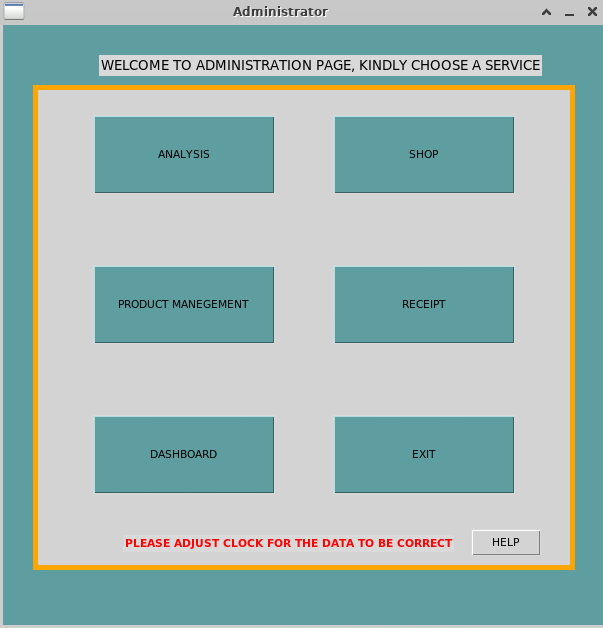

# ShopManagement
Python Shop Sales Management System

# Overview

# Tkinter App
This is a simple Emt Shop Sales Management System Created in Python Tkinter by Python Developer, Emmanuel H. Mtera

# About App
This is a simple point of sale app, which basically has about Five Functions which are :

1.	Analysis

2.	Dashboard

3.	Receipt or Single Customer Option

4.	Shop (Where daily sales are entered)

5.	Product Management (Where you manage all of your products)

# How to Use

1.	For existing users, Login into the administration panel and choose a service

2.	For new users click on login then click on createuser so as to create a new user

# Types of Services
1. Analysis Function
In the Analysis part sales can be exported on a daily basis,weekly,monthly or yearly. also there is option to see graphical preview.

2. Dashboard Function
Here you can customize shop name,number etc

3. Shop Function
Here is where all the daily transactions are done

4. Product Management
Here you can add products,list products,modify products,delete products,
This function automatically updates quantity left as soon a transaction is done

5. Receipt Function
Here is mode where you can simply print out a receipt to the user

# All options are straight foward and easy to use

